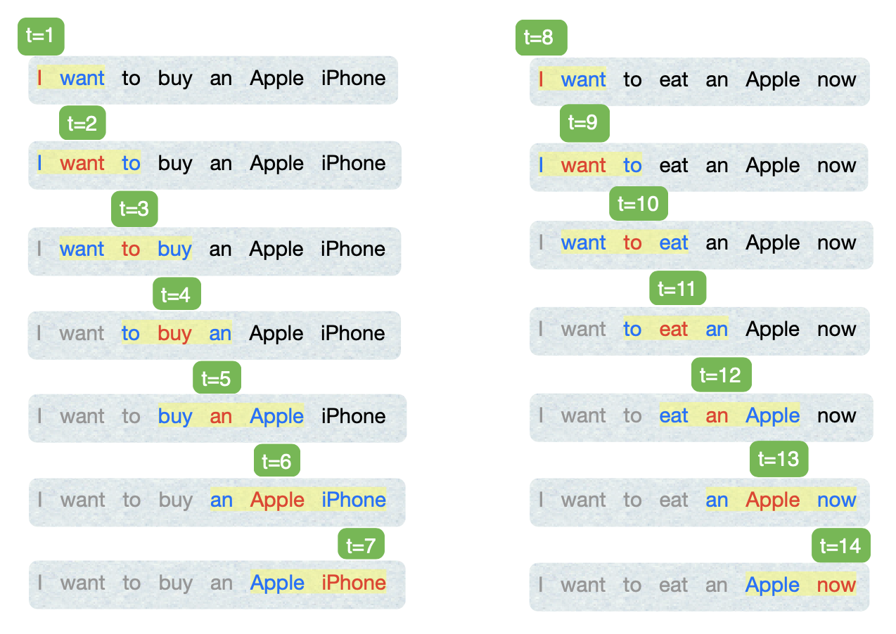

A tutorial, focused on Skip-Gram, for Word2vec with statistical details explained. 

<!--more-->

<!-- 
# A quick introduction!

# What are word vectors representations!
 -->

The word2vec, a family/group of related models, uses many contexts of a word to build up its numerical representation (e.g. a 300 dimensional vector). One of word2vec models, called skip-gram, is to learn the representation of a word against words in the context. Let's start with a toy example to illustrate this with a little bit theory behind it.

**Example.** Suppose we have a [corpus](https://www.merriam-webster.com/dictionary/corpus) of text containing two sentences:
- I want to buy an Apple iPhone.
- I want to eat an Apple now.

Notice the meaning of Apple will be a brand and a fruit respectively under different contexts that is easy for human to recognize but not for any machine. We will first create a vocabulary, denoted as $V$, with unique words in the corpus like below, where each word, for simplicity, is represented with 2 dimensional vector; $$[\theta_{\text{word},1},\theta_{\text{word},2}]\in\mathbb{R}^2.$$

| Word     | Vector |
| ----------- | ----------- |
| I      | $[\theta_{\text{I},1},\theta_{\text{I},2}]$       |
| want      | $[\theta_{\text{want},1},\theta_{\text{want},2}]$       |
| to      | $[\theta_{\text{to},1},\theta_{\text{to},2}]$       |
| buy      | $[\theta_{\text{buy},1},\theta_{\text{buy},2}]$       |
| eat      | $[\theta_{\text{eat},1},\theta_{\text{eat},2}]$       |
| an      | $[\theta_{\text{an},1},\theta_{\text{an},2}]$       |
| Apple      | $[\theta_{\text{Apple},1},\theta_{\text{Apple},2}]$       |
| iPhone      | $[\theta_{\text{iPhone},1},\theta_{\text{iPhone},2}]$       |
| now      | $[\theta_{\text{now},1},\theta_{\text{now},2}]$       |

Herein, let $V$ be a vocabulary set and $\boldsymbol{\theta}$ represent all model parameters
$$
\begin{align*}
V&=
\begin{pmatrix}
\text{I}\\\\
\text{want}\\\\
\text{to}\\\\
\text{buy}\\\\
\text{eat}\\\\
\text{an}\\\\
\text{Apple}\\\\
\text{iPhone}\\\\
\text{now}\\\\
\end{pmatrix}&
\boldsymbol{\theta}&=
\begin{bmatrix}
\theta_{\text{I},1}\\\\
\theta_{\text{I},2}\\\\
\theta_{\text{want},1}\\\\
\theta_{\text{want},2}\\\\
\vdots\\\\
\theta_{\text{iPhone},1} \\\\
\theta_{\text{iPhone},2} \\\\
\theta_{\text{now},1}\\\\
\theta_{\text{now},2}\\\\
\end{bmatrix}.
\end{align*}
$$

The next step is to determine how many contextual information you want, that is controlled by the window size $m$. In this example, let $m=1$ for simplicity. Now at every position of word in the corpus, $t=1,2,\ldots,14$, we will focus on the window with at most $2m+1$ words in it since at the start/end of sentence, the window will be **trimmed** in word2vec.

In the figure shown above, The highlighted band is referred to $\textcolor{BurntOrange}{\text{window}}$, in which the red word is called $\textcolor{red}{\text{center}}$ word and blue word is called $\textcolor{Cerulean}{\text{context}}$.

Suppose we now have the probability of $w_{t-1}$ given $w_t$ and the probability of $w_{t+1}$ given $w_t$;
$$\text{Pr}(w_{t-1}\mid w_t)\text{ and }\text{Pr}(w_{t+1}\mid w_t),$$
A natural way in statistics is to maximize the likelihood function
$$
\begin{align*}
L(\boldsymbol{\theta})
&=\prod\limits_{t=1}^{T=14}\prod\limits_{-m\le j\le m,j\neq0} \text{Pr}(w_{t+j}\mid w_t)\\\\
&=\text{Pr}(w_{2}\mid w_1) \\\\
&=\text{Pr}(w_{1}\mid w_2)\text{Pr}(w_{3}\mid w_2)\\\\
&=\cdots\\\\
&=\text{Pr}(w_{5}\mid w_6)\text{Pr}(w_{7}\mid w_6)\\\\
&=\text{Pr}(w_{6}\mid w_7)\\\\
&=\text{Pr}(w_{9}\mid w_8)\\\\
&=\text{Pr}(w_{8}\mid w_9)\text{Pr}(w_{10}\mid w_9)\\\\
&=\cdots\\\\
&=\text{Pr}(w_{12}\mid w_{13})\text{Pr}(w_{14}\mid w_{13})\\\\
&=\text{Pr}(w_{13}\mid w_{14})
\end{align*}
$$
People in machine learning/deep learning like to minimize a function for no particular reason so we equivalently minimize the negative log-likelihood (divided by a constant is a convention to make it not too large, think about billions of words) and name it loss function $J(\boldsymbol{\theta})$ below
$$
\begin{align*}
J(\boldsymbol{\theta})&=-\frac{1}{T}\sum\limits_{t=1}^T\sum\limits_{-m\le j\le m,j\neq0}\log \text{Pr}(w_{t+j}\mid w_j).
\end{align*}
$$
If we have the expression of $\text{Pr}(\cdot\mid\cdot)$ then we simply use (stochastic) gradient descent to minimize $J(\boldsymbol{\theta})$ to find the optimal $\boldsymbol{\theta}$. So, back in word2vec, we want to find a vector for each word so that it is **similar** to vectors of words that appear in similar contexts. As for the similarity of two words, we can use [cosine similarity](https://en.wikipedia.org/wiki/Cosine_similarity) (dot product). Hence, we could somehow convert the dot product to probability we assumed above. Considering the output of dot product could be negative, a natural choice is to use $\exp(\cdot)$ to make it positive and then normalize it to be a probability (that is, ranging from 0 to 1). In this way, $\text{Pr}(\textcolor{Cerulean}{\text{context}}\mid \textcolor{red}{\text{center}})$ is expressed as
$$
\frac{\exp(\textcolor{Cerulean}{\text{context}}^\top\textcolor{red}{\text{center}})}{Z},
$$
where $Z$ is just a normalization constant as follows
$$
Z=\sum\limits_{\text{word}\in\text{V}}\exp(\text{word}^\top\textcolor{red}{\text{center}})
$$
If we take the $\log(\cdot)$ with respect to $\text{Pr}(\textcolor{Cerulean}{\text{context}}\mid \textcolor{red}{\text{center}})$ because we have $\log(\cdot)$ in our loss function $J(\boldsymbol{\theta})$ too, then $\log\text{Pr}(\textcolor{Cerulean}{\text{context}}\mid \textcolor{red}{\text{center}})$ is expressed as
$$
\begin{align*}
\textcolor{Cerulean}{\text{context}}^\top\textcolor{red}{\text{center}}
-\log(Z),
\end{align*}
$$
Notice herein $\textcolor{red}{\text{center}}^\top\textcolor{red}{\text{center}}$ will happen in $Z$ since $\textcolor{red}{\text{center}}\in V$ too. This will make the gradient messy since it has literally square itself. In word2vec, it suggests to use two representations for each word (one for $\textcolor{Cerulean}{\text{context}}$, one for $\textcolor{red}{\text{center}}$) as follows

| Word     | Context Vector | Center Vector |
| ----------- | ----------- | ----------- |
| I | $[u_{\text{I},1},u_{\text{I},2}]$|$[v_{\text{I},1},v_{\text{I},2}]$       |
| want | $[u_{\text{want},1},u_{\text{want},2}]$|$[v_{\text{want},1},v_{\text{want},2}]$       |
| to | $[u_{\text{to},1},u_{\text{to},2}]$|$[v_{\text{to},1},v_{\text{to},2}]$       |
| buy | $[u_{\text{buy},1},u_{\text{buy},2}]$|$[v_{\text{buy},1},v_{\text{buy},2}]$       |
| eat | $[u_{\text{eat},1},u_{\text{eat},2}]$|$[v_{\text{eat},1},v_{\text{eat},2}]$       |
| an | $[u_{\text{an},1},u_{\text{an},2}]$|$[v_{\text{an},1},v_{\text{an},2}]$       |
| Apple | $[u_{\text{Apple},1},u_{\text{Apple},2}]$|$[v_{\text{Apple},1},v_{\text{Apple},2}]$       |
| iPhone | $[u_{\text{iPhone},1},u_{\text{iPhone},2}]$|$[v_{\text{iPhone},1},v_{\text{iPhone},2}]$       |
| now | $[u_{\text{now},1},u_{\text{now},2}]$|$[v_{\text{now},1},v_{\text{now},2}]$       |

Thus the model parameters will be updated to
$$
\begin{align*}
\boldsymbol{\theta}&=
\begin{bmatrix}
v_{\text{I},1}\\\\
v_{\text{I},2}\\\\
\vdots\\\\
v_{\text{now},1} \\\\
v_{\text{now},2} \\\\
u_{\text{I},1}\\\\
u_{\text{I},2}\\\\
\vdots\\\\
u_{\text{now},1} \\\\ 
u_{\text{now},2}
\end{bmatrix}.
\end{align*}
$$
Now we could avoid the square issue mentioned above which is beneficial from the computing perspective (but the original one still can work if you just try to optimize loss function no matter how). Anyhow, we have our probability function $\text{Pr}(\textcolor{Cerulean}{\text{context}}\mid \textcolor{red}{\text{center}})$ expressed as
$$
\frac{\exp(u_{\textcolor{Cerulean}{\text{context}}}^\top v_{\textcolor{red}{\text{center}})} }{\sum\limits_{\text{word}\in\text{V}}\exp(u_{\text{word}}^\top v_{\textcolor{red}{\text{center}} })},
$$ 
and consequently we could calculate our loss function $J(\boldsymbol{\theta})$ given $\boldsymbol{\theta}$.

If so, we could just initilize $\boldsymbol{\theta}$ by all zero and use stochastic gradient descent algorithm to update $\boldsymbol{\theta}$ one window at a time. We will discuss more details about gradient part.

TO BE CONTINUE